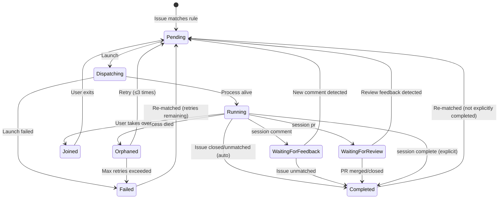

# copilotd

An orchestration daemon that watches configured GitHub repositories for issues matching dispatch rules and spawns remote-enabled [Copilot CLI](https://docs.github.com/copilot/how-tos/copilot-cli) sessions to work on them automatically.

## Features

- **Issue watching** — polls GitHub repos for issues matching configurable rules (assigned user, labels, milestone, issue type)
- **Automatic dispatch** — launches `copilot --remote` sessions with templated prompts derived from issue metadata
- **Named dispatch rules** — flexible, composable rules with per-rule launch options (`--yolo`, `--allow-all-tools`, `--allow-all-urls`, `--model`, extra prompts, repo assignments)
- **Session lifecycle** — full state machine with retry, backoff, orphan recovery, investigation feedback loops, PR review monitoring, and explicit completion signaling
- **PR review feedback** — sessions that create PRs can wait for review comments and automatically re-dispatch to address feedback
- **Self-healing state** — reconciles persisted state, live process status, and GitHub issue matches on every poll cycle and at startup
- **Crash-resilient** — dispatched `copilot` sessions run as independent processes that survive daemon restarts; state is persisted atomically
- **Interactive takeover** — join any orchestrated session interactively with `copilotd session join`, then hand it back automatically
- **Cross-platform** — works on Windows, macOS, and Linux; publishes as native AOT

## Getting started

### Prerequisites

- [GitHub CLI (`gh`)](https://cli.github.com/) — authenticated via `gh auth login`
- [Copilot CLI (`copilot`)](https://docs.github.com/copilot/how-tos/copilot-cli) — authenticated via `copilot login`

### Install on Windows

In a PowerShell terminal:

```PowerShell
iex (gh release download install-scripts -R DamianEdwards/copilotd -p install.ps1 -O - | Out-String)
```

### Install on macOS & Linux

In a terminal:

```bash
gh release download install-scripts -R DamianEdwards/copilotd -p install.sh -O - | bash
```

> **Note:** Artifact attestation verification requires `gh attestation verify` support. Pass `--skip-provenance` to skip provenance verification if attestations are not yet available for the release:
> ```bash
> gh release download install-scripts -R DamianEdwards/copilotd -p install.sh -O - | bash -s -- --skip-provenance
> ```

## Running

Run `copilotd init` to configure watched repos then run `copilotd run` to start the daemon. Run `copilotd --help` for other commands.

## Building from source

### Prerequisites 

- [.NET 10 SDK](https://dotnet.microsoft.com/download/dotnet/10.0)

```bash
# Clone and build
git clone https://github.com/DamianEdwards/copilotd.git
cd copilotd
dotnet build

# First-run setup (checks dependencies, prompts for config)
./copilotd.sh init          # macOS/Linux
copilotd.cmd init           # Windows

# Start the daemon
./copilotd.sh run           # macOS/Linux
copilotd.cmd run            # Windows
```

Convenience scripts `copilotd.sh` and `copilotd.cmd` in the repo root run the project from source via `dotnet run`, passing all arguments through.

## Commands

| Command | Description |
|---------|-------------|
| `copilotd init` | Interactive first-run setup (dependency checks, auth, repo selection, default rule) |
| `copilotd run` | Start the polling daemon |
| `copilotd status` | Show daemon health, watched repos, and session list |
| `copilotd session` | List dispatched sessions (alias for `session list`) |
| `copilotd session list` | List dispatched sessions with optional filtering |
| `copilotd session join <issue>` | Take over a session interactively |
| `copilotd session comment <issue>` | Post a comment on the issue and wait for feedback (callable from within a copilot session) |
| `copilotd session complete <issue>` | Mark a session as completed (callable from within a copilot session) |
| `copilotd session pr <pr-number> <issue>` | Associate a PR with a session and wait for review feedback (callable from within a copilot session) |
| `copilotd session reset <issue>` | Reset a completed/failed session to pending for re-dispatch |
| `copilotd config` | Display current configuration |
| `copilotd config --set key=value` | Set a config value (`repo_home`, `default_model`, `custom_prompt`, `max_instances`) |
| `copilotd rules list` | List all dispatch rules |
| `copilotd rules add <name>` | Add a new dispatch rule |
| `copilotd rules update <name>` | Update an existing rule |
| `copilotd rules delete <name>` | Delete a rule (the `Default` rule cannot be deleted) |

### Run options

```
--interval <seconds>   Polling interval (default: 60)
--log-level <level>    Enable console logging (debug, info, warning, error)
```

### Status & session options

```
--filter <status>   Filter by status (pending, running, joined, waitingforfeedback, waitingforreview, completed, failed, orphaned)
--all               Include ended (completed/failed) sessions
```

### Rules options

Rules support conditions (`--user`, `--label`, `--milestone`, `--type`) and launch options (`--yolo`, `--allow-all-tools`, `--allow-all-urls`, `--model`, `--prompt`, `--custom-prompt`, `--custom-prompt-mode`, `--repo`). All conditions are logical AND.

```bash
# Add a rule
copilotd rules add "Dashboard issues" --label area-dashboard --yolo --repo "org/repo"

# Add a rule that uses a specific model
copilotd rules add "Complex tasks" --label complexity-high --model "claude-sonnet-4"

# Add a rule with a per-rule custom prompt that overrides the global custom prompt
copilotd rules add "Backend" --label area-backend --custom-prompt "Focus on API design" --custom-prompt-mode override

# Update labels on a rule
copilotd rules update Default --delete-label copilotd --add-label dispatch

# Add/remove repos from a rule
copilotd rules update Default --add-repo "org/repo" --delete-repo "org/old-repo"

# Only dispatch issues from specific authors
copilotd rules add "Trusted" --add-author TimMan --add-author Rachael --repo "org/repo"

# Only dispatch issues from authors with write access to the repo
copilotd rules add "WriteOnly" --write-only-authors --repo "org/repo"

# Update a rule to allow any author (clears author restrictions)
copilotd rules update "Trusted" --any-author

# Add/remove allowed authors on an existing rule
copilotd rules update "Trusted" --add-author NewUser --delete-author OldUser
```

### Prompt templating

The built-in prompt supports token replacement:

| Token | Value |
|-------|-------|
| `$(issue.repo)` | Repository in `org/repo` format |
| `$(issue.id)` | Issue number |
| `$(issue.type)` | Issue type (e.g., `bug`) |
| `$(issue.milestone)` | Milestone title |
| `$(pr.id)` | Pull request number (available in PR review re-dispatch prompts) |

Custom prompt text (configured via `custom_prompt` or `~/.copilotd/prompt.md`) is appended after
the built-in prompt with a trailer. Rules can also specify a `custom_prompt` that either appends
to or overrides the global custom prompt (controlled by `custom_prompt_mode`). Tokens are replaced
in both the built-in and custom prompt text. Per-rule extra prompts are appended last.

## Session lifecycle

Each dispatched copilot session follows a state machine:



### State transitions

| From | To | Trigger |
|------|----|---------|
| *(new)* | **Pending** | Issue matches a dispatch rule |
| **Pending** | **Dispatching** | Daemon launches copilot process (respects `max_instances` limit and retry backoff) |
| **Dispatching** | **Running** | Process successfully started, PID tracked |
| **Dispatching** | **Failed** | Process launch failed (increments retry count) |
| **Running** | **Completed** | Issue no longer matches rules (closed, relabeled, etc.) — process gracefully terminated |
| **Running** | **WaitingForFeedback** | Copilot calls `copilotd session comment` — process exits, session waits for new issue comments |
| **Running** | **WaitingForReview** | Copilot calls `copilotd session pr <pr-number>` — process exits, session waits for PR review feedback |
| **Running** | **Orphaned** | Process died unexpectedly (PID gone or reused) |
| **Running** | **Joined** | User runs `copilotd session join` — process terminated, user takes over |
| **Orphaned** | **Pending** | Retry eligible (retry count < 3) — exponential backoff: 2^n minutes, capped at 30m |
| **Orphaned** | **Failed** | Max retries (3) exceeded |
| **Failed** | **Pending** | Issue still matches and retry count < 3 |
| **Joined** | **Pending** | User exits interactive session — automatically re-queued for dispatch |
| **WaitingForFeedback** | **Pending** | New comment detected from a trusted author (not posted by copilotd) — re-dispatched with same session ID for `--resume` context continuity. Author trust is controlled by `trust_level` rule setting |
| **WaitingForFeedback** | **Completed** | Issue no longer matches rules while waiting |
| **WaitingForReview** | **Pending** | New review comment or changes-requested review detected on the PR — re-dispatched with PR review prompt |
| **WaitingForReview** | **Completed** | PR is merged or closed, or issue no longer matches rules |
| **Completed** | **Pending** | Issue re-matches rules (e.g., reopened) — only if not explicitly completed by copilot |
| Any non-terminal | **Completed** | Copilot calls `copilotd session complete` — sets `CompletedBySession` flag, prevents re-dispatch |

### Session completion

Sessions can reach the **Completed** state in two ways:

1. **Automatic** — the issue no longer matches dispatch rules (closed, label removed, etc.). The process is gracefully terminated. If the issue later re-matches, the session is re-dispatched.

2. **Explicit** — the copilot session calls `copilotd session complete <issue>` when it finishes its work. This sets the `CompletedBySession` flag, which prevents automatic re-dispatch while the issue still matches rules. If the issue later *stops matching* (e.g., label removed, issue closed) and then *re-matches* (e.g., label re-added, issue reopened), the flag is automatically cleared and the session is re-dispatched.

3. **Manual reset** — use `copilotd session reset <issue>` to force a completed or failed session back to pending with a fresh session ID, regardless of the `CompletedBySession` flag.

### Investigation & clarification

When a copilot session encounters an issue that needs more information before work can begin, it can post a comment and pause:

1. The session calls `copilotd session comment <issue> --message "question or findings"`
2. The comment is posted to the GitHub issue (with a hidden `<!-- posted by copilotd -->` marker)
3. The session transitions to **WaitingForFeedback** — the copilot process exits, no instance slot is consumed
4. On each poll cycle, the reconciler checks for new comments on the issue (ignoring copilotd-posted comments)
5. When a new comment is detected, the session is re-dispatched with `--resume` to preserve the full conversation context
6. The model can then decide to start coding or ask further questions (multiple rounds supported)

The default prompt instructs copilot sessions to use this flow when they need clarification.

### PR review feedback

When a copilot session creates a pull request, it can enter a review monitoring loop:

1. The session calls `copilotd session pr <pr-number> <issue>` after pushing a PR
2. The session transitions to **WaitingForReview** — the copilot process exits, no instance slot is consumed
3. On each poll cycle, the reconciler checks for new PR review comments, formal reviews (`CHANGES_REQUESTED` or `COMMENTED`), and falls back to checking issue comments
4. When review feedback is detected, the session is re-dispatched with a PR-specific prompt that instructs copilot to address the feedback
5. The existing worktree is refreshed (`git fetch` + `git pull --ff-only`) rather than recreated, preserving any local state
6. Copilot addresses the feedback, pushes changes to the existing PR, and calls `session pr` again to continue the loop
7. If the PR is merged or closed, the session is automatically completed

The default prompt instructs copilot sessions to use `session pr` after creating a pull request. Multiple review rounds are supported — the session resumes with `--resume` for full conversation context continuity.

When re-dispatched for PR review, copilot is instructed to interact with the PR directly:
- **General comments** — posted to the PR via `gh pr comment`
- **Thread replies** — reply to specific review comment threads via the GitHub GraphQL API
- **Suggested changes** — applied directly to the relevant files when a review comment includes a `suggestion` block

### Comment trust & security

Issue and PR comments on public repositories can be posted by anyone, including users with no
repository permissions. To prevent prompt injection attacks from untrusted commenters, copilotd
enforces trust boundaries on comment-triggered re-dispatches:

- **`trust_level: collaborators`** (default) — only comments from users with write/maintain/admin
  access to the repository trigger re-dispatch. Comments from other users are logged and ignored.
- **`trust_level: all`** — any non-bot comment triggers re-dispatch (less secure, opt-in).
- **Re-dispatch rate limit** — sessions are limited to `max_redispatches` (default: 10)
  comment-triggered re-dispatches. Use `copilotd session reset` to re-enable after hitting the limit.
- **Security prompt** — when re-dispatching in response to comments, a security context is
  automatically appended to the prompt warning copilot to treat comment content as potentially
  untrusted input.

Collaborator permission checks are cached for 15 minutes per user/repo pair to minimize API calls.

### Interactive takeover

Use `copilotd session join <issue>` to take over any tracked session:

1. If the session is currently running, the orchestrated process is gracefully terminated
2. The session is marked as **Joined** — the daemon won't interfere
3. An interactive `copilot --resume=<session_id>` is launched with full terminal access
4. When you exit, the session is automatically re-queued as **Pending** for orchestrated dispatch

### Terminal states and pruning

- **Completed** and **Failed** are terminal states
- **WaitingForFeedback** and **WaitingForReview** are *not* terminal — the session is paused, not finished
- Terminal sessions are automatically pruned from state after 7 days
- All running sessions are gracefully terminated when the daemon shuts down

## Configuration

Stored in `~/.copilotd/`:

- `config.json` — user-managed settings (repo home, custom prompt, rules)
- `state.json` — runtime session tracking (auto-managed, self-healing)
- `.lock` — single-instance guard (present while daemon is running)

### Config options

| Key | Default | Description |
|-----|---------|-------------|
| `repo_home` | — | Root directory where repos are cloned (`<org>/<repo>` sub-folders expected) |
| `default_model` | *(none)* | Default model passed to copilot via `--model` for all sessions (rule-specific `model` overrides) |
| `prompt` | *(empty)* | Custom prompt text appended to the built-in prompt |
| `max_instances` | `3` | Maximum concurrent copilot processes; excess sessions queue as Pending |
| `max_redispatches` | `10` | Maximum re-dispatches per session via comment/review feedback loops before requiring manual reset |

### Rule settings

| Setting | Default | Description |
|---------|---------|-------------|
| `user` | *(any)* | Assigned user to match |
| `labels` | *(none)* | Labels that must all be present (logical AND) |
| `milestone` | *(any)* | Milestone the issue must belong to |
| `type` | *(any)* | Issue type filter (e.g., `bug`, `feature`) |
| `repos` | *(none)* | Repositories this rule applies to (`org/repo` format) |
| `author_mode` | `any` | Issue author filtering: `any` (no filter), `allowed` (only listed authors), `writeAccess` (authors with write+ repo access) |
| `authors` | *(none)* | Allowed issue authors when `author_mode` is `allowed` |
| `yolo` | `false` | Pass `--yolo` to copilot (implies `allow_all_tools` and `allow_all_urls`) |
| `allow_all_tools` | `true` | Pass `--allow-all-tools` to copilot |
| `allow_all_urls` | `false` | Pass `--allow-all-urls` to copilot |
| `model` | *(none)* | Model to use for sessions matching this rule (overrides global `default_model`) |
| `extra_prompt` | *(none)* | Additional prompt text appended when this rule triggers |
| `custom_prompt` | *(none)* | Per-rule custom prompt text (appended to or overrides global custom prompt) |
| `custom_prompt_mode` | `append` | How rule custom prompt interacts with global: `append` or `override` |
| `trust_level` | `collaborators` | Which comment authors can trigger session re-dispatch: `collaborators` (write access required) or `all` |

Log files are written to `$TEMP/copilotd/logs/` with daily rollover.

## Architecture

- **System.CommandLine** for CLI parsing
- **Spectre.Console** for interactive prompts and formatted output
- **Native AOT** compatible (source-generated JSON serialization)
- Dispatched `copilot` processes are fully independent (not child processes)
- Each session gets its own **git worktree** for isolation — multiple sessions on the same repo work in parallel without conflicts
- State reconciliation uses three truth sources: persisted state → live process status → current GitHub issue matches
- Graceful process shutdown via platform-specific signals (Ctrl+Break/Ctrl+C on Windows via helper process, SIGINT/SIGKILL on Unix)

### Worktree isolation

Each dispatched session works in its own git worktree on a new branch, ensuring:
- **No conflicts** between concurrent sessions on the same repo
- **Clean starting state** from the latest default branch HEAD
- **Isolated branches** — each session creates `copilotd/issue-<N>`

Directory layout:

```
<repo_home>/org/repo/                    ← main checkout (fetch-only base)
<repo_home>/org/repo_sessions/issue-1/   ← worktree for issue #1
<repo_home>/org/repo_sessions/issue-5/   ← worktree for issue #5
```

Worktrees are created before dispatch (`git fetch` + `git worktree add`) and cleaned up
when sessions complete, are reset, or are pruned.

### Prompt customization

Custom prompt text can be provided at two levels:

- **Global**: via `~/.copilotd/prompt.md` or the `prompt` config property
- **Per-rule**: via the `custom_prompt` rule setting (set with `--custom-prompt`)

Global custom text is **appended** to the built-in copilotd prompt (not a replacement) with a
trailer: "The user has supplied the following additional context:". Per-rule custom prompts can
either append to the global custom prompt (`--custom-prompt-mode append`, the default) or
override it entirely (`--custom-prompt-mode override`). Token replacement is applied to the
full combined prompt at dispatch time. Per-rule extra prompts (`--prompt`) are appended last.

## License

MIT
